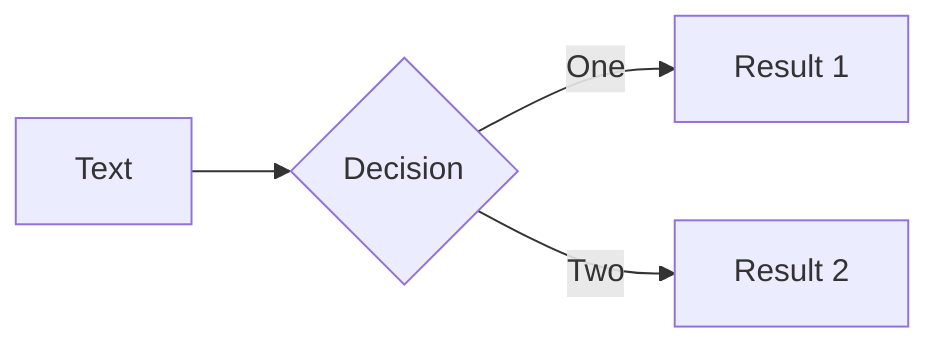
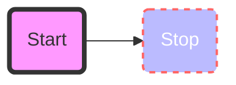
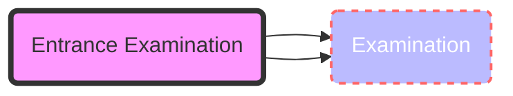
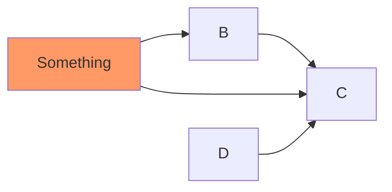
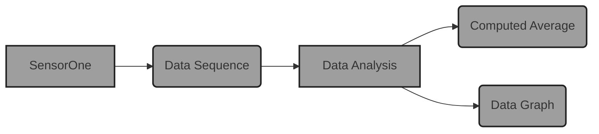
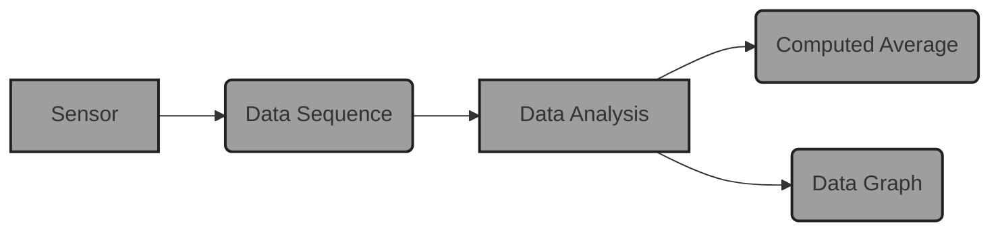

# Simple Slidev Sample

## Slides that Illustrate Slidev's Features

**Gregory M. Kapfhammer**

<div class="pt-12">
  <span @click="$slidev.nav.next" class="px-2 p-1 rounded cursor-pointer" hover="bg-black bg-opacity-30">
    Press Space for next page <carbon:arrow-right class="inline"/>
  </span>
</div>

<a href="https://github.com/gkapfham/simple-slidev-sample" target="_blank" alt="GitHub"
  class="abs-br m-6 text-xl icon-btn opacity-100 !border-none !hover:text-dark-500">
  <carbon-logo-github />
</a>

<!--
The last comment block of each slide will be treated as slide notes. It will be visible and editable in Presenter Mode along with the slide. [Read more in the docs](https://sli.dev/guide/syntax.html#notes)
-->

---

# What is Slidev?

## Slidev is a slides maker and presenter designed for developers, consist of the following features

Slidev is a slides maker and presenter designed for developers, consist of the following features

The variable <pre>f</pre> a variable in this bulleted list

- 📝 **Text-based** - focus on the content with Markdown, and then style them later
- 🎨 **Themable** - theme can be shared and used with npm packages
- 🧑‍💻 **Developer Friendly** - code highlighting, live coding with autocompletion
- 🤹 **Interactive** - embedding Vue components to enhance your expressions
- 🎥 **Recording** - built-in recording and camera view
- 📤 **Portable** - export into PDF, PNGs, or even a hostable SPA
- 🛠 **Hackable** - anything possible on awebpage
- <pre>f</pre> is a variable in this bulleted list

<pre>f</pre> is a variable in this bulleted list

<br>

Read more about [Why Slidev?](https://sli.dev/guide/why)

<!--
You can have `style` tag in markdown to override the style for the current page.
Learn more: https://sli.dev/guide/syntax#embedded-styles
-->

---

# Code Slide

```python {all|2-3|5|all}
# this is a comment
hello = "hello"
world = "world"
space = " "
value = .50
message = world + space + hello
print(f"The message is: {message}")
```

<style>
</style>

---

# Code Slide Again

```python
@annotation
def square(value: int):
    return value * value

def mapper(f, sequence):
    result = (  )
    for element in sequence:
        result += ( f(element), )
    return result

squared_range = mappper(square, range(10))
print(squared_range)

```

<style>
</style>

---

# New Slide Again

<v-clicks>

- A monoid is an ordered pair $(S, \otimes)$ for a set $S$ and any binary
operator $\otimes$ that satisfies the following conditions:


    - **Type Preservation**: $\forall s_1, s_2 \in S$, $s_1 \otimes
                  s_2 \in S$

    - **Associative Property**: $\forall s_1, s_2, s_3 \in S$, $(s_1
                  \otimes s_2) \otimes s_3 = s_1 \otimes (s_2 \otimes s_3)$

    - **Identity Element**: $\exists \epsilon \in S$, such that
        $\forall s \in S, \epsilon \otimes s = s$ and
        $s \otimes \epsilon = s$

-   We often say that "$S$ is a monoid under $\otimes$ with identity
    $\epsilon$"

-   If you know how strings behave then you understand the monoid;
"monoid" describes "string-like" structures

</v-clicks>

---

# Simpler Slide with Bulleted List

<v-clicks>

- Item 1

  - Sub list
  - Sub list again

- Item 2
- Item 3
- Item 4

</v-clicks>

<div class="grid grid-cols-2 gap-x-1">

<uim-rocket class="text-8xl text-orange-400" />

<arrow x1="180" y1="420" x2="480" y2="420" color="#1c1c1c" width="3" arrowSize="1" />

<uim-rocket class="text-8xl text-orange-400" />

</div>

---
class: text-center
---

# Simple slid with some math

<v-click>

We often say that "$S$ is a monoid under $\otimes$ with identity $\epsilon$"

</v-click>

<v-click>



</v-click>

---

# Another exciting slide

<AutoFitText :max="80" :min="100" modelValue="How did I meet Mathew?"/>

---
class: center
---

# Another exciting slide

<div class="grid grid-cols-2 gap-x-1">








</div>

---

# Separate Diagram Slide

<div class="absolute top-30 left-40">



</div>

<div class="absolute top-80 left-20">

- What happens when I am typing a long message and I see some $f(x)$

</div>

---

# Separate Diagram Slide AGAIN!

<div class="container mx-auto px-25 py-5">



</div>

<div class="absolute top-80 left-20">

- What happens when I am typing a long message and I see some $f(x)$

</div>

---

# Separate Diagram Slide LAST

<div class="absolute top-30 left-40">


</div>

<div class="absolute top-80 left-20">

- What happens when I am typing a long message and I see some $f(x)$

</div>

