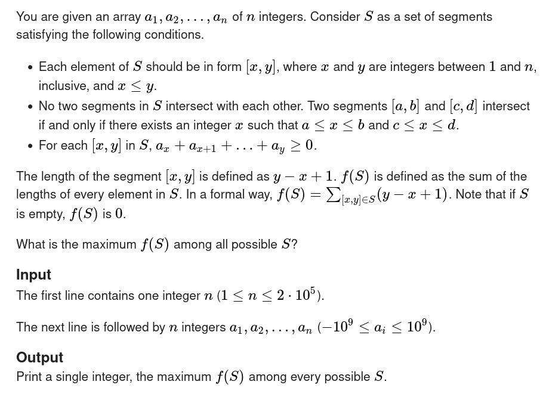
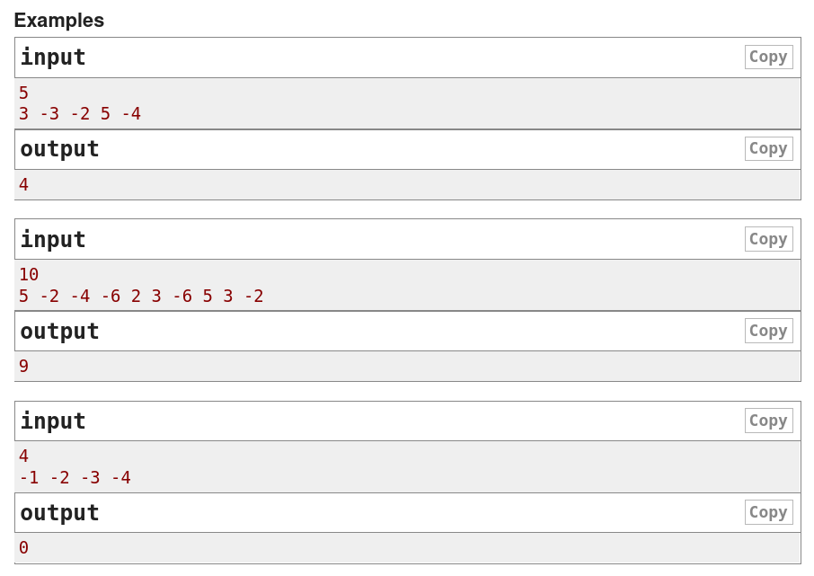
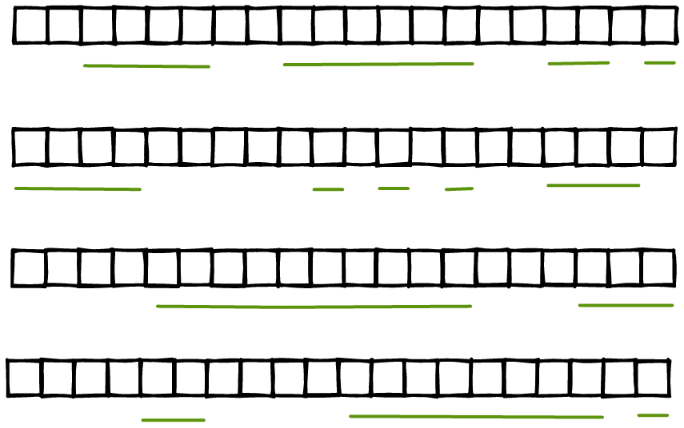
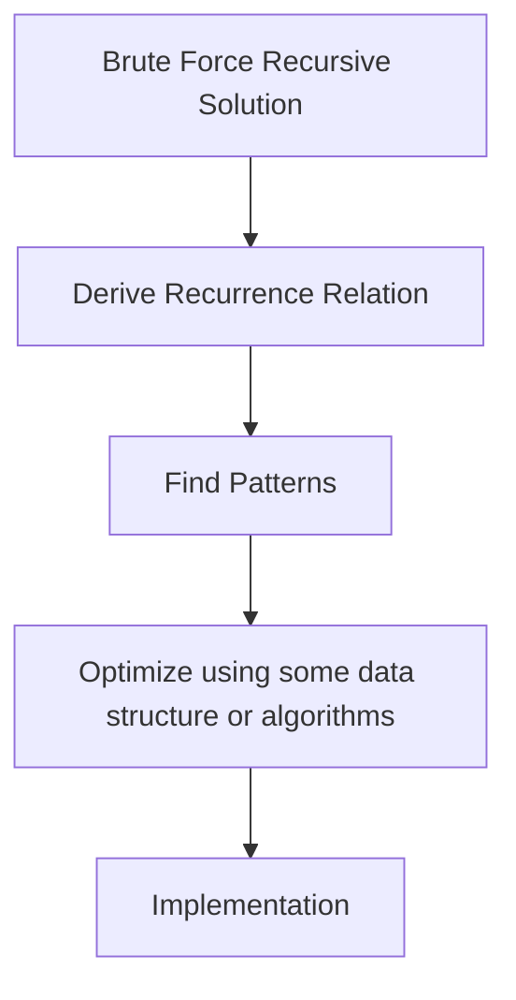

# Dynamic Programming Optimization

## Optimize Recurrence Relations

**Nachiket Kanore**


---

# Codeforces 1788E - Sum Over Zero

<center>

</center>


---

# Codeforces 1788E - Sum Over Zero

<center>

</center>

---

# Problem Visualization

<center>

<br>
There can be exponentially large number of sets to consider
</center>


---

# Mathematical Representation


<v-clicks>

-  Find maximum sum of lengths of disjoint subarrays each having sum greater than equal to 0

- $S$ is a set of disjoint subarrays to be considered, each subarray having $sum \geq 0$

- $$f(S) = \sum_{[x,y] \in S} (y-x+1)$$


- We need to find the maximum value of $f(S)$ over all possible sets $S$

</v-clicks>
<!-- <v-clicks> -->
<!-- </v-clicks> -->

---

# Observations and Solutions

<v-clicks>

- There can be **exponentially** many choices to make

- Let's start with some simple `recursive brute force` solution

- Let's start constructing our subset of subarrays

- We start from index 1

- Choices at each point $i$:

  1. **Take the subarray starting at $i$**, can end anywhere at $j$, $i \leq j \leq N$ with the condition that sum of elements from i to j is $\geq 0$

  2. **Dont' take this element in any subarray**, and move onto next index


</v-clicks>
<!-- TODO: <v-clicks> -->
<!-- </v-clicks> -->

---

# Implementation:  Recursive Brute Force

<style>
  code {
    @apply text-1xl
  }
</style>

```cpp{all|6-7|9-16|all}
int go(int i) {
  if (i > N)
    return 0;
  int ans = 0;

  // Choice 1: Dont' consider A[i] in any subarray
  ans = max(ans, go(i + 1));

  // Choice 2: Consider A[i] in some subarray
  for (int j = i; j <= N; j++) {

    int subarray_sum = A[j] - A[i - 1]; // A is the pref array
    if (subarray_sum >= 0) {
      ans = max(ans, (j - i + 1) + go(j + 1));
    }
  }
  return ans;
}

// Answer = go(1)

```

---


# Memoization

<style>
  code {
    @apply text-1xl
  }
</style>

```cpp{all|4-6|all}
int go(int i) {
  if (i > N)
    return 0;
  int& ans = dp[i]; // dp array is filled with -1 initially
  if (~ans) return ans;
  ans = 0;
  // Choice 1: Dont' consider A[i] in any subarray
  ans = max(ans, go(i + 1));
  // Choice 2: Consider A[i] in some subarray
  for (int j = i; j <= N; j++) {
    int subarray_sum = A[j] - A[i - 1];
    if (subarray_sum >= 0) {
      ans = max(ans, (j - i + 1) + go(j + 1));
    }
  }
  return ans;
}
// Answer = go(1)

```

- Time Complexity of full solution will be $O(N^2)$

---

# Recurrence Relation

<v-clicks>

- Let's define $dp_i$ as the best answer we can find until index $i$

- $dp_i = max_{1 \leq j \leq i}(dp_{j-1} + (i - j + 1)), dp_{i-1}$

- for all $j \leq i$ such that $\sum_{k=j}^{k=i} A_i \geq 0$

- Base conditions:
    - $dp_0 = 0$

- Answer = $dp_N$

</v-clicks>

---

# Simplifying Recurrence Relation

<v-clicks>

- $dp_i = max_{j \leq i}(dp_{j-1} + (i - j + 1)), dp_{i-1}$

- for all $j \leq i$ such that $\sum_{k=j}^{k=i} a_i \geq 0$

- Let's denote $\sum_{k=j}^{k=i} a_i \geq 0$ by [$pref_i - pref_{j-1} \geq 0$] where $pref_i$ denotes the sum of first $i$ elements of array A

- Now, the relation becomes:

  - $dp_i = max_{j \leq i}(dp_{j-1} + (i - j + 1)), dp_{i-1}$

  - for all $j \leq i$ such that $pref_i - pref_{j-1} \geq 0$

  - or $pref_i \geq pref_{j-1}$


</v-clicks>

---

# Simplifying Recurrence Relation


<style>
code {
  @apply text-1xl
}
</style>


- We arrived at:

    - $dp_i = max_{j \leq i}(dp_{j-1} + (i - j + 1)), dp_{i-1}$

    - such that $pref_i \geq pref_{j-1}$

```cpp{all|3|4-5|7-12|14|all}
for (int i = 1; i <= N; i++) {
  cin >> A[i];
  A[i] += A[i - 1]; // A becomes the pref array
  // Choice 1: Don't consider A[i] in any subarray
  dp[i] = max(dp[i], dp[i - 1]);

  // Choice 2: Consider A[i] is some subarray starting at some j
  for (int j = i; j >= 1; j--) {
    if (A[i] - A[j - 1] >= 0) {
      dp[i] = max(dp[i], (i - j + 1) + dp[j - 1]);
    }
  }
}
cout << dp[N];
```

---

# Observations

<v-clicks>

- $dp_i = max_{j \leq i}(dp_{j-1} + (i - j + 1)), dp_{i-1}$

- $dp_i = max_{j \leq i}(dp_{j-1} + (i) - (j-1)), dp_{i-1}$

- $dp_i = (i) + max_{j \leq i}(dp_{j-1} - (j-1)), dp_{i-1}$

- $dp_i = (i) + max_{id < i}(dp_{id} - (id)), dp_{i-1}$
    - such that $pref_i \geq pref_{id} , id < i$

- This recurrence is in `one-variable-form` now

</v-clicks>

---


# Improvisation

<v-clicks>

- We keep storing this value: $dp_{(id)}-(id)$ as a single variable and use it for
computation later

- Since, we will be iterating over all $pref_{id}$ such that $pref_i \geq pref_{id} , id < i$, we will store the info:

    - $[ pref_i, dp_i - i ]$ in some data structure for retrieval later

    - Here, $pref_i$ will be our **KEY**

    - and $dp_i - i$ will be our **VALUE**

- Then, we will retrieve the best value to update our $dp_i$ with..

- This needs to be stored after computing $dp_i$

</v-clicks>

---

# Implementation

<style>
  code {
    @apply text-1xl
  }
</style>

```cpp{all|1-2|5|6-13|14-15|16|18|all}
vector<pair<int, int>> my_data_structure;
my_data_structure.push_back({ 0, 0 });
for (int i = 1; i <= N; i++) {
  cin >> A[i];
  A[i] += A[i - 1]; // Prefix-sum array inplace
  int best = -INF;
  for (auto [key, value] : my_data_structure) {
    if (key <= A[i]) {
      best = max(best, value);
    }
  }
  // Choice 1
  dp[i] = max(dp[i], i + best);
  // Choice 2
  dp[i] = max(dp[i], dp[i - 1]);
  my_data_structure.push_back(make_pair(A[i], dp[i] - i));
}
cout << dp[N];
```

---

# How to retrieve faster?

<style>
p {
  font-size: 20px;
}
</style>

<v-clicks>

- Notice that we are iterating over all **keys below $A_i$
that is the range $[-\infty, A_i]$**

- Hence, we need some data structure that can give the maximum value in the
range $[-\infty, A_i]$ with the key $A_i$ on each iteration quickly

- What data structure can give you max value in a range faster?
- And also support adding **keys**, both faster

- `Segment trees`

- In this specific problem, I used `Implicit Segment Tree`

- Reason: **Keys** can get arbitrarily large and may not fit segment tree's index

- `Implicit Segment Tree` can support arbitrarily large indices

</v-clicks>

---

# Implicit Segment Trees: Node and constructor

```cpp{1-5|6-10|all}
struct node {
  int mx;
  node* left;
  node* right;
}
node() {
  mx = -INF;
  left = NULL;
  right = NULL;
}
```
---


# Implicit Segment Trees:  Update

<style>
  code {
    @apply text-1xl
  }
</style>

```cpp{1|2|3-14|5-8|9-12|15|all}
node* update(int l, int r, int id, int val) {
  mx = max(mx, val);
  if (l < r) {
    int mid = (l + r) >> 1;
    if (id <= mid) {
      if (left == NULL)
        left = new node();
      left = left->update(l, mid, id, val);
    } else {
      if (right == NULL)
        right = new node();
      right = right->update(mid+1, r, id, val);
    }
  }
  return this;
}

```
---

# Implicit Segment Trees: Query
```cpp{1|2|3-6|4|8-9|10-11|all}
void get_max(int tl, int tr, int ql, int qr) {
  if (tl > qr || tr < ql) return ;
  if (ql <= tl && tr <= qr) {
    best_mx = max(best_mx, mx);
    return;
  }
  int mid = (tl + tr) / 2;
  if (left != NULL)
    left->get_max(tl, mid, ql, qr);
  if (right != NULL)
    right->get_max(mid+1, tr, ql, qr);
}
```

---

# Implicit Segment Trees: Initialization
```cpp{1|3|5|7|9}
const int OFFSET = 1e15;

const int INF = 1e16;

node* root = new root();

root = root->update(0, INF, A[i] + OFFSET, dp[i] - i);

root->get_max(0 , INF, 0, A[i] + OFFSET);

```

We use the `OFFSET` to make sure the query ranges
for segment tree are $\geq 0$
---

# Problem Solving Workflow

<center>

</center>
---

# Final Code Walkthrough

- https://codeforces.com/contest/1788/submission/197351413

---

# Better Solution

<v-clicks>

- Without using Implicit Segment Trees

- `pref` array is used only to compare which value is small or large

- We don't need to store those large **keys**

- `Coordinate Compression`

- Compress `pref` values in the range $[1, N]$

- Then use them as **keys** in `Segment Tree` or `Fenwick Tree`

</v-clicks>

---

# Better Solution: Walkthrough

- https://codeforces.com/contest/1788/submission/197354030

---

# Code Comparison


---

# Thank You

<v-clicks>


https://www.linkedin.com/in/nachiketkanore/

https://github.com/nachiketkanore/

https://twitter.com/nachiket_kanore

Like and Share

Subscribe for more content

</v-clicks>
